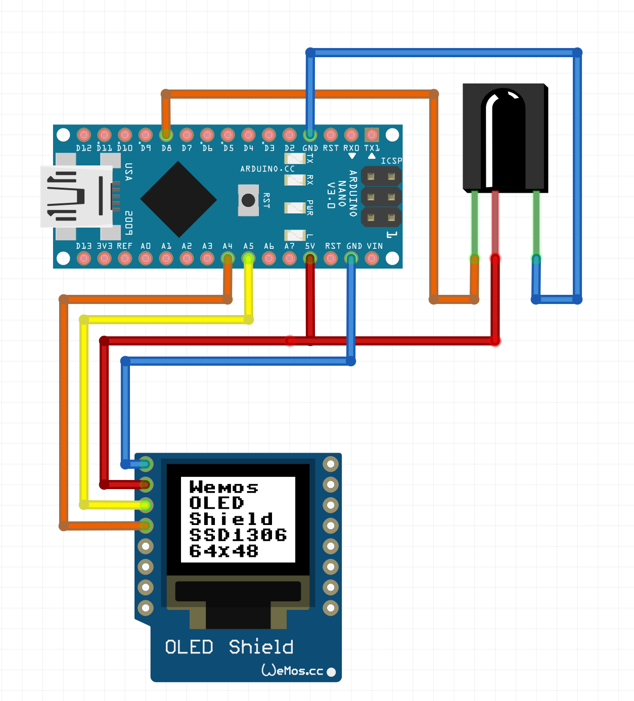

# IR Reader Gadget

## Components

- Arduino Nano [1]
- SSD1306 Display [2]
- IR receiver module [3]

## Scheme

- [1] PIN 8 -> [3] PIN Y
- [1] GND -> [3] PIN G
- [1] 5V -> [3] PIN R
- [2] GND -> [1] GND
- [2] VCC -> [1] 5V/3.3V
- [2] SCL -> [1] A5
- [2] SDA -> [1] A4
